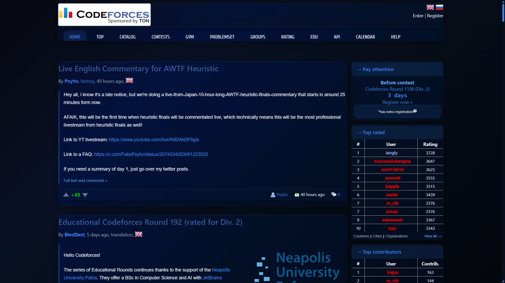
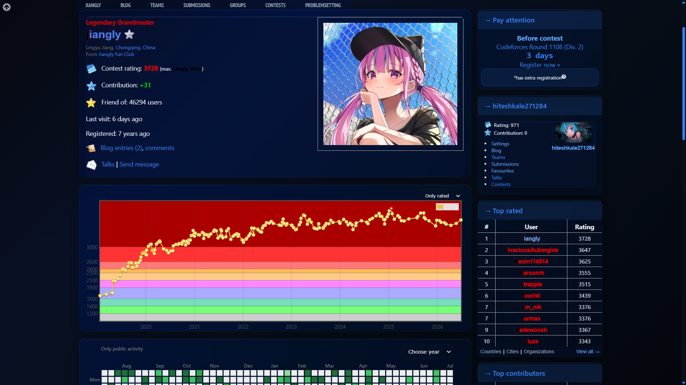
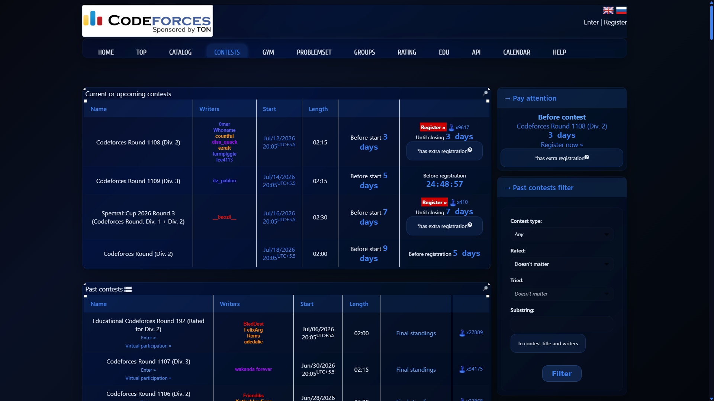

# Acrylic Codeforces

Premium theme for [Codeforces](https://codeforces.com) full acrylic UI.

## Screenshots

| Home | Profile | Contest List |
|---|---|---|
|  |  |  |


## Installation

### Prerequisites

- [Stylus](https://add0n.com/stylus/) browser extension (v2.x, MV3 compatible)

### One-Click Install

1. Install the Stylus extension for your browser:
   - [Chrome / Edge / Brave](https://chrome.google.com/webstore/detail/stylus/clngdbkpkpeebahjckkjfobafhncgmne)
   - [Firefox](https://addons.mozilla.org/en-US/firefox/addon/styl-us/)
   - [Opera](https://addons.opera.com/en-gb/extensions/details/stylus/)

2. Click the link below to install:
   - [Install Acrylic Codeforces](https://raw.githubusercontent.com/HkHacker22/d-bluecodeforces/main/acrylic-codeforces.user.css)

3. The Stylus extension will open a preview page. Click **Install Style**.

### Manual Install

1. Clone the repo:
   ```
   git clone https://github.com/HkHacker22/d-bluecodeforces.git
   ```

2. Open Stylus extension → **Manage** → **Write New Style**

3. Copy the contents of `acrylic-codeforces.user.css` into the editor

4. Set **Applies to** to `URLs on the domain: codeforces.com`

5. Click **Save**

## Customization

After installing, click the Stylus icon → gear icon next to "Acrylic Codeforces" to open settings:

| Setting | Description |
|---|---|
| Theme Preset | Choose from 10 color schemes |
| Custom Wallpaper URL | Paste any image URL as background |
| Built-in Wallpaper | Pick from 8 preset backgrounds |
| Blur Amount | Adjust glass blur intensity (0-40px) |
| Glass Opacity | Set panel transparency |
| Saturation | Control color vibrance |
| Frosted Mode | Extra frosted glass effect |
| Full Acrylic Mode | Apply acrylic to all panels |
| Pure Transparent Mode | Fully transparent panels |
| Compact Mode | Reduce spacing |

## License

MIT
